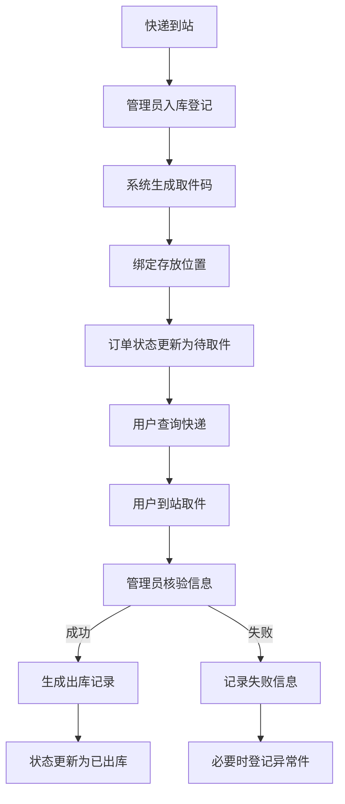
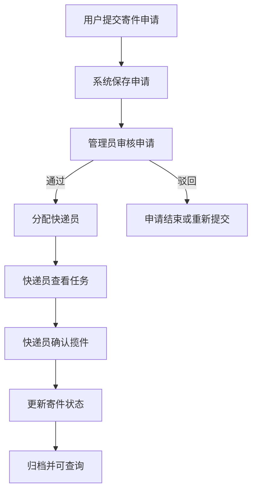
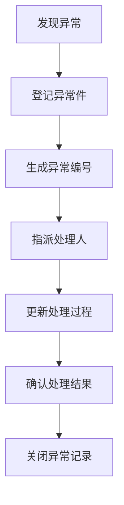

# 校园快递管理系统总体设计说明书

## 1. 文档说明

### 1.1 文档目的

本文档用于从零开始对“校园快递管理系统”进行完整设计，不涉及具体代码实现，重点输出项目在课程设计阶段所需的核心方案，包括：

- 项目背景与建设目标
- 业务场景与流程描述
- 需求分析与功能设计
- 角色权限设计
- 数据分析与数据库设计
- 页面与模块规划
- 非功能需求
- 测试验收建议
- 实施路线与风险控制

本文档可作为后续以下材料的上位依据：

- 项目计划书
- 需求说明书
- 业务流程分析
- 功能分析表
- 数据分析表
- E-R 图设计
- 数据库表设计
- 原型图设计
- 测试报告
- 答辩 PPT

### 1.2 编写依据

本文档综合参考了课程项目常见模板结构，并结合校园快递场景的实际需求进行重构，目标是形成一份逻辑完整、可交付、可继续扩展的课程项目设计文档。

### 1.3 项目名称

建议统一项目名称为：

**校园快递管理系统**

### 1.4 文档定位

本文档既可视为“项目总体设计说明书”，也可作为“课程设计总说明文档”使用。

## 2. 项目概述

### 2.1 项目背景

随着校园网购的普及，校内快递数量持续增长，传统的人工登记、电话通知、纸面取件方式逐渐暴露出以下问题：

- 快递到站后登记效率低
- 存放位置依赖人工记忆，容易出错
- 用户查询方式不便，信息不透明
- 取件核验缺乏统一流程，容易出现误领、漏领
- 异常件缺少专门处理台账，难以追踪
- 寄件业务与收件业务分散管理，不利于统一统计

因此，有必要设计一套面向校园快递站点的轻量级管理系统，以实现快递业务的数字化、规范化与可追溯化管理。

### 2.2 项目目标

本项目的建设目标如下：

1. 实现快递收件、寄件、异常处理的全过程数字化管理。
2. 提供面向学生/老师、快递员、管理员的分角色操作能力。
3. 实现快递入库、查件、取件、出库的业务闭环。
4. 提供基础统计分析能力，提高站点管理效率。
5. 为后续扩展扫码取件、消息提醒、报表导出等功能预留设计空间。

### 2.3 项目范围

本项目面向校园内部快递站点日常管理场景，主要覆盖以下业务：

- 校园快递收件入库
- 用户快递查询与取件
- 用户寄件申请
- 异常件登记与处理
- 用户信息与订单信息管理
- 数据统计与业务分析

本阶段不强制实现但可作为后续扩展的内容包括：

- 短信/微信通知
- 扫码枪自动录入
- 小程序/移动端接入
- 报表导出
- 智能推荐货架位置

### 2.4 项目价值

对于校园快递站点：

- 提高入库和出库效率
- 降低快递错放、漏领风险
- 规范异常件处理过程
- 提高业务统计和管理能力

对于学生/老师：

- 可以快速查询快递状态
- 明确取件码和存放位置
- 简化取件流程
- 方便提交寄件申请

对于课程实践：

- 场景真实
- 角色清晰
- 流程完整
- 易于展示与答辩

## 3. 项目干系人与角色设计

### 3.1 干系人识别

本项目主要干系人包括：

- 学生
- 老师
- 快递员
- 快递站管理员
- 系统维护人员
- 课程指导教师

### 3.2 角色定义

为保证系统结构清晰，建议采用三类核心角色设计。

#### 3.2.1 普通用户

包含：

- 学生
- 老师

主要职责：

- 查询本人快递
- 查看取件码、存放位置、快递状态
- 提交寄件申请
- 查看历史寄件/取件记录
- 维护个人基础信息

#### 3.2.2 快递员

主要职责：

- 查看被分配的寄件任务
- 确认揽件
- 更新寄件状态
- 查看与自己相关的订单信息

#### 3.2.3 管理员

主要职责：

- 快递入库登记
- 生成取件码
- 出库核验
- 异常件登记与处理
- 用户管理
- 订单管理
- 统计分析
- 基础配置维护

### 3.3 角色权限矩阵

| 功能模块 | 普通用户 | 快递员 | 管理员 |
| --- | --- | --- | --- |
| 登录系统 | 是 | 是 | 是 |
| 查看本人快递 | 是 | 否 | 是 |
| 查看全站快递 | 否 | 否 | 是 |
| 提交寄件申请 | 是 | 否 | 是 |
| 查看分配任务 | 否 | 是 | 是 |
| 快递入库登记 | 否 | 否 | 是 |
| 生成取件码 | 否 | 否 | 是 |
| 出库确认 | 否 | 否 | 是 |
| 异常件登记 | 否 | 否 | 是 |
| 异常件处理 | 否 | 否 | 是 |
| 用户管理 | 否 | 否 | 是 |
| 统计分析 | 否 | 否 | 是 |
| 操作日志查看 | 否 | 否 | 是 |

## 4. 业务场景分析

### 4.1 业务场景一：收件入库

快递公司将包裹送达校园快递站后，管理员需要登记快递单号、快递公司、收件人信息、存放位置等内容。系统在登记完成后生成取件码，并将订单状态更新为“待取件”。

### 4.2 业务场景二：用户查件与取件

用户登录系统后，可查看本人待取件快递，获取取件码和存放位置。到站后，管理员根据快递单号、取件码和身份信息核验后完成出库处理。

### 4.3 业务场景三：寄件申请

用户需要寄件时，在系统中填写寄件申请，由管理员审核后分配快递员。快递员完成揽件后，系统更新状态并形成寄件记录。

### 4.4 业务场景四：异常处理

当出现快递丢失、损坏、信息错误、无人认领、取件核验失败等情况时，管理员需登记异常信息，指定处理人，记录处理过程，并在问题解决后关闭异常。

### 4.5 业务场景五：统计与管理

管理员可通过系统查看今日入库量、出库量、在库量、异常件数量、寄件申请数量等数据，用于日常运营管理和课程项目展示。

## 5. 需求分析

### 5.1 功能需求总览

系统功能建议划分为以下六类：

1. 用户与登录管理
2. 收件业务管理
3. 寄件业务管理
4. 异常件管理
5. 订单与记录管理
6. 统计与配置管理

### 5.2 普通用户功能需求

#### 5.2.1 登录与身份识别

- 用户可通过账号密码登录系统
- 登录后系统根据身份加载对应功能菜单

#### 5.2.2 我的快递

- 查看本人待取件快递列表
- 查看快递单号、快递公司、入库时间、存放位置、取件码、当前状态
- 查看历史取件记录

#### 5.2.3 快递查询

- 按快递单号查询本人快递
- 按时间范围查看快递记录
- 查询结果需限制为本人可见数据

#### 5.2.4 寄件申请

- 填写寄件人信息
- 填写收件人姓名、手机号、地址
- 选择或填写快递公司偏好
- 提交申请并查看申请状态

#### 5.2.5 个人中心

- 查看个人基本信息
- 修改手机号或密码
- 查看历史寄件和取件记录

### 5.3 快递员功能需求

#### 5.3.1 寄件任务管理

- 查看待揽件任务
- 查看寄件申请详情
- 确认已揽件
- 更新寄件状态

#### 5.3.2 订单查询

- 查看与自己相关的寄件记录
- 按时间和状态进行筛选

### 5.4 管理员功能需求

#### 5.4.1 入库管理

- 录入快递单号、收件人、快递公司、快递员、存放位置
- 自动生成取件码
- 更新状态为“待取件”
- 防止重复入库

#### 5.4.2 出库管理

- 根据快递单号和取件码核验快递信息
- 完成出库登记
- 更新订单状态
- 记录操作人员和操作时间

#### 5.4.3 寄件管理

- 查看用户提交的寄件申请
- 审核申请信息
- 分配快递员
- 跟踪寄件状态

#### 5.4.4 异常件管理

- 登记异常件
- 指派处理人
- 更新处理过程
- 记录处理结果
- 关闭异常记录

#### 5.4.5 订单管理

- 查看全站收件记录
- 查看全站寄件记录
- 按快递单号、状态、用户编号、时间进行筛选

#### 5.4.6 用户管理

- 查看用户列表
- 查看用户身份和所属公司
- 启用/停用账号
- 维护角色信息

#### 5.4.7 统计分析

- 查看今日入库量
- 查看今日出库量
- 查看当前在库量
- 查看异常件数量
- 查看寄件申请数量
- 查看超时未取件数量

### 5.5 扩展功能需求

以下内容作为增强设计，可在后续版本实现：

- 扫码录入快递单号
- 二维码取件
- 消息提醒
- 批量入库/批量出库
- Excel 报表导出
- 货架利用率分析

## 6. 业务规则设计

为保证系统可控，建议定义以下核心业务规则。

### 6.1 收件业务规则

1. 同一快递单号不可重复入库。
2. 入库成功后必须生成唯一取件码。
3. 只有状态为“待取件”的订单才允许出库。
4. 出库完成后必须记录操作人员和出库时间。
5. 若取件码校验失败，可记录失败次数并触发异常登记。

### 6.2 寄件业务规则

1. 寄件申请提交后必须生成唯一申请编号。
2. 申请未经审核不得进入“已揽件”状态。
3. 每条寄件记录必须能追踪责任快递员。
4. 已取消申请不可再次直接激活，应重新提交。

### 6.3 异常处理规则

1. 每条异常记录必须关联具体快递单号或业务单号。
2. 异常状态应至少区分“待处理、处理中、已解决、已关闭”。
3. 未完成处理的异常记录不得直接删除。
4. 异常关闭前必须填写处理结果。

### 6.4 权限规则

1. 普通用户只能查看本人快递和本人寄件记录。
2. 快递员只能查看与自己相关的寄件任务。
3. 管理员可查看并处理全站业务数据。
4. 敏感信息在展示时应根据权限进行脱敏。

## 7. 业务流程设计

### 7.1 收件主流程

#### 7.1.1 流程描述

收件流程从“快递到站”开始，到“用户完成取件并出库”结束，属于系统最核心的业务链路。

#### 7.1.2 流程步骤

1. 快递公司将快递送达校园站点。
2. 管理员核对快递信息并进行入库登记。
3. 系统生成取件码并绑定存放位置。
4. 系统更新快递状态为“待取件”。
5. 用户登录系统查看快递信息。
6. 用户到站后提交取件信息。
7. 管理员校验快递单号、取件码和身份信息。
8. 校验成功则完成出库登记，更新状态为“已出库”。
9. 校验失败则记录失败信息，必要时生成异常件记录。

#### 7.1.3 收件流程图



### 7.2 寄件主流程

#### 7.2.1 流程描述

寄件流程从“用户提交寄件申请”开始，到“快递员确认揽件并寄出”结束。

#### 7.2.2 流程步骤

1. 用户填写寄件申请。
2. 系统保存申请并标记为“已提交”。
3. 管理员审核申请内容。
4. 审核通过后分配快递员。
5. 快递员查看待揽件任务。
6. 快递员确认揽件。
7. 系统更新寄件状态为“已寄出”或“已揽件”。
8. 订单进入归档状态，供用户和管理员查询。

#### 7.2.3 寄件流程图



### 7.3 异常处理流程

#### 7.3.1 流程描述

异常处理流程适用于快递丢失、损坏、信息错误、长期无人认领、核验失败等异常情况。

#### 7.3.2 流程步骤

1. 系统或管理员发现异常。
2. 管理员登记异常信息。
3. 系统生成异常编号。
4. 管理员指派处理人。
5. 处理人更新处理进度。
6. 管理员确认处理结果。
7. 异常状态更新为“已关闭”。

#### 7.3.3 异常流程图



### 7.4 状态流转设计

#### 7.4.1 收件状态流转

```text
待入库 -> 已入库 -> 待取件 -> 已取件 -> 已出库
任意环节 -> 异常
```

#### 7.4.2 寄件状态流转

```text
已提交 -> 待审核 -> 已分配 -> 已揽件 -> 已寄出
已提交/待审核 -> 已取消
任意环节 -> 异常
```

#### 7.4.3 异常状态流转

```text
待处理 -> 处理中 -> 已解决 -> 已关闭
```

## 8. 功能结构设计

### 8.1 总体功能结构

```text
校园快递管理系统
├─ 用户与认证模块
│  ├─ 登录
│  ├─ 角色识别
│  ├─ 个人中心
│  └─ 密码修改
├─ 收件管理模块
│  ├─ 快递入库
│  ├─ 取件码生成
│  ├─ 快递查询
│  ├─ 出库核验
│  └─ 取件记录
├─ 寄件管理模块
│  ├─ 寄件申请
│  ├─ 申请审核
│  ├─ 任务分配
│  └─ 揽件确认
├─ 异常管理模块
│  ├─ 异常登记
│  ├─ 异常处理
│  ├─ 异常关闭
│  └─ 异常统计
├─ 管理支撑模块
│  ├─ 用户管理
│  ├─ 订单管理
│  ├─ 查询记录
│  ├─ 操作日志
│  └─ 配置管理
└─ 统计分析模块
   ├─ 入库统计
   ├─ 出库统计
   ├─ 在库统计
   ├─ 异常统计
   └─ 寄件统计
```

### 8.2 页面规划建议

#### 8.2.1 普通用户端

- 登录页
- 首页/我的快递
- 快递查询页
- 寄件申请页
- 历史记录页
- 个人中心页

#### 8.2.2 快递员端

- 登录页
- 任务列表页
- 任务详情页
- 状态更新页

#### 8.2.3 管理员端

- 登录页
- 管理首页
- 入库管理页
- 出库管理页
- 收件订单页
- 寄件订单页
- 异常件管理页
- 账号信息页
- 统计分析页
- 设置页

## 9. 数据分析设计

### 9.1 数据设计目标

数据设计需要满足以下目标：

- 能准确表达业务对象和业务关系
- 能记录关键业务动作
- 支持状态追踪和历史回溯
- 支持统计分析与后续扩展

### 9.2 核心数据对象

建议将系统数据对象分为核心业务对象和支撑对象。

#### 9.2.1 核心业务对象

- 用户 `user`
- 快递主表 `package`
- 入库记录 `storage_record`
- 取件信息 `pickup_info`
- 出库记录 `outbound_record`
- 寄件申请 `send_request`
- 异常记录 `exception_record`

#### 9.2.2 支撑对象

- 查询记录 `query_record`
- 通知记录 `notification_record`
- 操作日志 `operation_log`
- 系统配置 `system_config`

### 9.3 主要数据项分析

| 数据项 | 含义 | 来源 | 类型建议 | 约束 |
| --- | --- | --- | --- | --- |
| user_id | 用户编号 | 系统生成 | BIGINT | 唯一、非空 |
| username | 用户名 | 用户输入/导入 | VARCHAR(50) | 非空 |
| role | 角色 | 系统配置 | ENUM/VARCHAR | 非空 |
| phone | 手机号 | 用户输入 | VARCHAR(20) | 可校验格式 |
| tracking_number | 快递单号 | 快递单据 | VARCHAR(32) | 唯一、非空 |
| pickup_code | 取件码 | 系统生成 | VARCHAR(12) | 唯一、非空 |
| storage_location | 存放位置 | 管理员录入 | VARCHAR(50) | 非空 |
| current_status | 当前状态 | 系统维护 | VARCHAR(20) | 非空 |
| request_status | 寄件申请状态 | 系统维护 | VARCHAR(20) | 非空 |
| exception_status | 异常状态 | 系统维护 | VARCHAR(20) | 非空 |
| operator_id | 操作人员编号 | 系统识别 | BIGINT | 外键 |
| handle_time | 处理时间 | 系统记录 | DATETIME | 可追溯 |

### 9.4 数据字典建议

#### 9.4.1 角色字典

| 取值 | 说明 |
| --- | --- |
| 普通用户 | 学生或老师 |
| 快递员 | 负责揽件/配送的人员 |
| 管理员 | 站点管理与系统管理人员 |

#### 9.4.2 包裹状态字典

| 取值 | 说明 |
| --- | --- |
| 待入库 | 快递尚未完成登记 |
| 已入库 | 已登记但尚未生成完整取件链路 |
| 待取件 | 用户可来站取件 |
| 已取件 | 用户已领取 |
| 已出库 | 出库完成 |
| 待寄件 | 用户已提交寄件申请 |
| 已寄出 | 快递员完成揽件 |
| 异常 | 当前业务存在异常问题 |

#### 9.4.3 异常类型字典

| 取值 | 说明 |
| --- | --- |
| 丢失 | 快递丢失 |
| 损坏 | 快递破损 |
| 信息错误 | 收件信息不正确 |
| 无人认领 | 长时间无人取件 |
| 核验失败 | 取件码或身份核验失败 |
| 其他 | 其他特殊情况 |

## 10. 数据库设计

### 10.1 数据库设计原则

1. 主数据与过程数据分离。
2. 当前状态与历史记录分离。
3. 关键业务动作必须可追溯。
4. 表结构命名统一、字段命名统一。
5. 预留后续统计和接口扩展空间。

### 10.2 概念结构设计

系统主要实体及关系如下：

- 一个用户可以对应多条快递记录
- 一个包裹对应一条当前主记录
- 一个包裹可对应一条入库记录和一条取件信息
- 一个包裹可对应零条或多条异常记录
- 一个寄件申请由一个用户发起，并可分配给一个快递员
- 关键操作均可形成操作日志

### 10.3 逻辑结构设计

建议数据库包含以下主要表：

1. `user`
2. `package`
3. `storage_record`
4. `pickup_info`
5. `outbound_record`
6. `send_request`
7. `exception_record`
8. `query_record`
9. `notification_record`
10. `operation_log`

### 10.4 表设计详细说明

#### 10.4.1 用户表 `user`

| 字段名 | 类型建议 | 主键 | 非空 | 说明 |
| --- | --- | --- | --- | --- |
| user_id | BIGINT | 是 | 是 | 用户编号 |
| username | VARCHAR(50) | 否 | 是 | 用户名 |
| role | VARCHAR(20) | 否 | 是 | 用户角色 |
| phone | VARCHAR(20) | 否 | 否 | 手机号 |
| department | VARCHAR(100) | 否 | 否 | 院系/部门 |
| company | VARCHAR(100) | 否 | 否 | 所属快递公司 |
| password_hash | VARCHAR(255) | 否 | 是 | 密码摘要 |
| account_status | VARCHAR(20) | 否 | 是 | 账号状态 |
| created_time | DATETIME | 否 | 是 | 创建时间 |

设计说明：

- 普通用户和快递员、管理员统一存储在一张用户表中。
- `company` 主要用于快递员。
- `account_status` 用于启用/停用控制。

#### 10.4.2 包裹主表 `package`

| 字段名 | 类型建议 | 主键 | 非空 | 说明 |
| --- | --- | --- | --- | --- |
| package_id | BIGINT | 是 | 是 | 包裹编号 |
| tracking_number | VARCHAR(32) | 否 | 是 | 快递单号 |
| business_type | VARCHAR(20) | 否 | 是 | 收件/寄件 |
| company | VARCHAR(100) | 否 | 否 | 快递公司 |
| sender_name | VARCHAR(50) | 否 | 否 | 寄件人姓名 |
| sender_phone | VARCHAR(20) | 否 | 否 | 寄件人电话 |
| receiver_id | BIGINT | 否 | 否 | 收件人编号 |
| courier_id | BIGINT | 否 | 否 | 快递员编号 |
| current_status | VARCHAR(20) | 否 | 是 | 当前状态 |
| created_time | DATETIME | 否 | 是 | 创建时间 |
| remark | VARCHAR(255) | 否 | 否 | 备注 |

设计说明：

- 该表用于保存快递当前最新业务状态。
- `business_type` 用于区分收件业务与寄件业务。

#### 10.4.3 入库记录表 `storage_record`

| 字段名 | 类型建议 | 主键 | 非空 | 说明 |
| --- | --- | --- | --- | --- |
| storage_id | BIGINT | 是 | 是 | 入库记录编号 |
| package_id | BIGINT | 否 | 是 | 包裹编号 |
| tracking_number | VARCHAR(32) | 否 | 是 | 快递单号 |
| shelf_no | VARCHAR(20) | 否 | 否 | 货架号 |
| storage_location | VARCHAR(50) | 否 | 是 | 存放位置 |
| operator_id | BIGINT | 否 | 是 | 操作人员编号 |
| storage_time | DATETIME | 否 | 是 | 入库时间 |
| remark | VARCHAR(255) | 否 | 否 | 备注 |

#### 10.4.4 取件信息表 `pickup_info`

| 字段名 | 类型建议 | 主键 | 非空 | 说明 |
| --- | --- | --- | --- | --- |
| pickup_id | BIGINT | 是 | 是 | 取件信息编号 |
| package_id | BIGINT | 否 | 是 | 包裹编号 |
| tracking_number | VARCHAR(32) | 否 | 是 | 快递单号 |
| receiver_id | BIGINT | 否 | 是 | 收件人编号 |
| pickup_code | VARCHAR(12) | 否 | 是 | 取件码 |
| storage_location | VARCHAR(50) | 否 | 是 | 存放位置 |
| expire_time | DATETIME | 否 | 否 | 过期时间 |
| create_time | DATETIME | 否 | 是 | 生成时间 |
| remark | VARCHAR(255) | 否 | 否 | 备注 |

#### 10.4.5 出库记录表 `outbound_record`

| 字段名 | 类型建议 | 主键 | 非空 | 说明 |
| --- | --- | --- | --- | --- |
| outbound_id | BIGINT | 是 | 是 | 出库记录编号 |
| package_id | BIGINT | 否 | 是 | 包裹编号 |
| tracking_number | VARCHAR(32) | 否 | 是 | 快递单号 |
| receiver_id | BIGINT | 否 | 是 | 收件人编号 |
| operator_id | BIGINT | 否 | 是 | 操作人员编号 |
| verify_result | VARCHAR(20) | 否 | 是 | 核验结果 |
| outbound_time | DATETIME | 否 | 是 | 出库时间 |
| remark | VARCHAR(255) | 否 | 否 | 备注 |

#### 10.4.6 寄件申请表 `send_request`

| 字段名 | 类型建议 | 主键 | 非空 | 说明 |
| --- | --- | --- | --- | --- |
| request_id | BIGINT | 是 | 是 | 申请编号 |
| tracking_number | VARCHAR(32) | 否 | 否 | 快递单号 |
| sender_id | BIGINT | 否 | 是 | 寄件人编号 |
| receiver_name | VARCHAR(50) | 否 | 是 | 收件人姓名 |
| receiver_phone | VARCHAR(20) | 否 | 是 | 收件人电话 |
| receiver_address | VARCHAR(255) | 否 | 是 | 收件地址 |
| courier_id | BIGINT | 否 | 否 | 分配快递员编号 |
| operator_id | BIGINT | 否 | 否 | 审核或处理人员编号 |
| request_status | VARCHAR(20) | 否 | 是 | 申请状态 |
| request_time | DATETIME | 否 | 是 | 申请时间 |
| send_time | DATETIME | 否 | 否 | 揽件/寄出时间 |
| remark | VARCHAR(255) | 否 | 否 | 备注 |

#### 10.4.7 异常记录表 `exception_record`

| 字段名 | 类型建议 | 主键 | 非空 | 说明 |
| --- | --- | --- | --- | --- |
| exception_id | BIGINT | 是 | 是 | 异常编号 |
| package_id | BIGINT | 否 | 否 | 包裹编号 |
| tracking_number | VARCHAR(32) | 否 | 是 | 快递单号 |
| exception_type | VARCHAR(20) | 否 | 是 | 异常类型 |
| exception_status | VARCHAR(20) | 否 | 是 | 异常状态 |
| description | VARCHAR(255) | 否 | 否 | 异常描述 |
| operator_id | BIGINT | 否 | 是 | 登记人员编号 |
| handler_id | BIGINT | 否 | 否 | 处理人员编号 |
| handle_time | DATETIME | 否 | 否 | 处理时间 |
| result | VARCHAR(255) | 否 | 否 | 处理结果 |
| remark | VARCHAR(255) | 否 | 否 | 备注 |

#### 10.4.8 查询记录表 `query_record`

| 字段名 | 类型建议 | 主键 | 非空 | 说明 |
| --- | --- | --- | --- | --- |
| query_id | BIGINT | 是 | 是 | 查询记录编号 |
| user_id | BIGINT | 否 | 是 | 查询用户编号 |
| package_id | BIGINT | 否 | 否 | 包裹编号 |
| query_keyword | VARCHAR(100) | 否 | 是 | 查询关键词 |
| query_result | VARCHAR(20) | 否 | 是 | 查询结果 |
| query_time | DATETIME | 否 | 是 | 查询时间 |

#### 10.4.9 通知记录表 `notification_record`

| 字段名 | 类型建议 | 主键 | 非空 | 说明 |
| --- | --- | --- | --- | --- |
| notification_id | BIGINT | 是 | 是 | 通知编号 |
| user_id | BIGINT | 否 | 是 | 接收用户编号 |
| package_id | BIGINT | 否 | 否 | 对应包裹编号 |
| notification_type | VARCHAR(20) | 否 | 是 | 通知类型 |
| content | VARCHAR(255) | 否 | 是 | 通知内容 |
| send_status | VARCHAR(20) | 否 | 是 | 发送状态 |
| send_time | DATETIME | 否 | 否 | 发送时间 |

#### 10.4.10 操作日志表 `operation_log`

| 字段名 | 类型建议 | 主键 | 非空 | 说明 |
| --- | --- | --- | --- | --- |
| log_id | BIGINT | 是 | 是 | 日志编号 |
| operator_id | BIGINT | 否 | 是 | 操作人编号 |
| operation_type | VARCHAR(50) | 否 | 是 | 操作类型 |
| target_type | VARCHAR(50) | 否 | 是 | 目标对象类型 |
| target_id | BIGINT | 否 | 否 | 目标对象编号 |
| operation_result | VARCHAR(20) | 否 | 是 | 操作结果 |
| operation_time | DATETIME | 否 | 是 | 操作时间 |
| detail | VARCHAR(255) | 否 | 否 | 详细说明 |

### 10.5 表关系说明

| 主表 | 关系 | 从表 | 说明 |
| --- | --- | --- | --- |
| user | 1:N | package | 一个用户可关联多条包裹记录 |
| user | 1:N | send_request | 一个用户可提交多条寄件申请 |
| package | 1:1/N | storage_record | 一个包裹至少有零或一条入库记录 |
| package | 1:1/N | pickup_info | 一个包裹可生成一条取件信息 |
| package | 1:1/N | outbound_record | 一个包裹出库时形成记录 |
| package | 1:N | exception_record | 一个包裹可有多条异常记录 |
| user | 1:N | operation_log | 一个操作人员可产生多条日志 |

### 10.6 索引与约束建议

建议重点建立以下索引：

- `tracking_number` 唯一索引
- `pickup_code` 唯一索引
- `receiver_id` 普通索引
- `courier_id` 普通索引
- `current_status` 普通索引
- `request_status` 普通索引
- `exception_status` 普通索引
- `storage_time`、`outbound_time`、`query_time` 时间索引

建议关键约束如下：

- 快递单号唯一
- 取件码在有效期内唯一
- 外键字段需与用户和包裹主表保持引用一致
- 未关闭异常不可物理删除，建议采用逻辑删除策略

## 11. 界面与交互设计建议

### 11.1 设计目标

- 页面简洁清晰
- 操作路径短
- 重点信息突出
- 结果反馈明确

### 11.2 页面设计原则

1. 首页优先展示关键业务信息。
2. 表单区域和数据表格区域应明确分开。
3. 操作按钮命名保持统一，如“查询、确认、保存、处理、返回”。
4. 对成功、失败、无数据三类场景都提供明确提示。

### 11.3 首页优化建议

#### 普通用户首页

- 展示“待取件数量”
- 展示最近一条快递信息
- 快速进入“查询”“寄件申请”

#### 快递员首页

- 展示“待揽件任务数”
- 展示最近任务列表

#### 管理员首页

- 展示今日入库量
- 展示今日出库量
- 展示当前在库量
- 展示待处理异常数
- 展示最新业务记录

## 12. 非功能需求设计

### 12.1 性能需求

- 普通查询响应时间不超过 2 秒
- 列表分页默认每页展示 10 到 20 条数据
- 高峰期连续入库操作应保持流畅
- 常用查询字段应建立索引以提升查询效率

### 12.2 安全需求

- 密码采用加密方式存储
- 用户只能查看本人数据
- 管理员拥有更高权限但需记录操作日志
- 手机号等敏感数据应支持脱敏显示
- 关键操作需具备日志追踪能力

### 12.3 可用性需求

- 核心业务应在 3 步内完成
- 提供明确的错误提示与成功反馈
- 表单输入要有基本校验
- 页面结构应适合非专业用户快速理解

### 12.4 可维护性需求

- 状态值和角色值尽量字典化管理
- 命名规范统一
- 主数据与记录数据分表设计
- 文档、原型、数据库字段保持一致

### 12.5 可扩展性需求

- 支持增加通知渠道
- 支持增加扫码设备接入
- 支持增加报表导出
- 支持接入移动端

## 13. 测试与验收设计

### 13.1 测试目标

确保系统在核心业务流程、数据一致性、权限控制和异常处理方面满足设计要求。

### 13.2 测试分类

- 功能测试
- 流程测试
- 权限测试
- 异常测试
- 数据一致性测试
- 性能测试

### 13.3 核心测试场景

#### 场景一：收件入库

- 管理员录入一条快递信息
- 系统成功生成取件码
- 快递状态更新为“待取件”

#### 场景二：用户查件

- 普通用户只能查询本人的快递
- 非本人快递不可见

#### 场景三：取件出库

- 输入正确取件码后可完成出库
- 输入错误取件码时不可出库

#### 场景四：寄件申请

- 用户可提交寄件申请
- 管理员审核并分配快递员
- 快递员确认揽件后状态正确变化

#### 场景五：异常处理

- 可新增异常记录
- 可更新异常状态
- 可填写处理结果并关闭异常

### 13.4 验收标准建议

项目验收时建议至少演示以下主线：

1. 管理员完成快递入库并生成取件码。
2. 用户查询到自己的快递并完成取件。
3. 用户提交寄件申请，管理员分配快递员，快递员确认揽件。
4. 管理员登记并关闭一条异常记录。
5. 展示管理员统计页面或统计数据说明。

## 14. 实施路线建议

### 14.1 第一阶段：口径统一

产出：

- 统一项目名称
- 统一角色定义
- 统一状态流转
- 统一字段命名

### 14.2 第二阶段：设计定稿

产出：

- 业务流程图
- 功能结构图
- E-R 图
- 数据库设计文档
- 页面原型

### 14.3 第三阶段：开发与联调

产出：

- 前后端基础功能
- 数据库建表
- 核心流程联调

### 14.4 第四阶段：测试与答辩准备

产出：

- 测试用例
- 测试报告
- 演示脚本
- 答辩 PPT

## 15. 风险分析与应对

| 风险点 | 风险描述 | 应对措施 |
| --- | --- | --- |
| 需求范围过大 | 功能点过多导致实现不完整 | 明确 MVP，先做主流程 |
| 数据设计不统一 | 文档与数据库口径不一致 | 统一名词和字段定义 |
| 原型与需求不一致 | 页面能展示但逻辑不闭环 | 先以流程驱动原型 |
| 权限设计不清 | 不同角色功能边界混乱 | 提前固定权限矩阵 |
| 测试不充分 | 答辩时暴露流程漏洞 | 提前设计测试脚本 |

## 16. 项目亮点总结

本项目可重点强调以下亮点：

1. 场景真实，贴近校园日常生活。
2. 角色明确，便于展示多角色协同业务。
3. 收件、寄件、异常三条主线完整。
4. 数据设计兼顾当前实现与后续扩展。
5. 文档体系完整，适合作为课程设计成果展示。

## 17. 后续扩展方向

若后续继续完善，可优先考虑以下方向：

- 接入短信/微信消息提醒
- 增加二维码或扫码枪取件
- 增加批量入库和导入导出能力
- 增加小程序端查询入口
- 增加滞留件预警和自动异常生成
- 增加运营报表与趋势分析

## 18. 结论

校园快递管理系统是一个业务边界清晰、流程完整、适合课程实践展示的项目。  
从设计角度看，项目最关键的不是追求复杂技术，而是确保：

- 角色定义清楚
- 主流程闭环完整
- 数据模型统一
- 页面逻辑可展示
- 验收脚本可落地

只要围绕“入库、查件、取件、寄件、异常、统计”这六个核心关键词推进，该项目就可以形成一套较完整的课程设计成果。

## 19. 一句话总结

**本系统的设计核心，是用统一的角色、流程和数据模型，把校园快递站点的收件、寄件和异常处理业务组织成一个可管理、可查询、可追踪、可展示的完整系统。**
